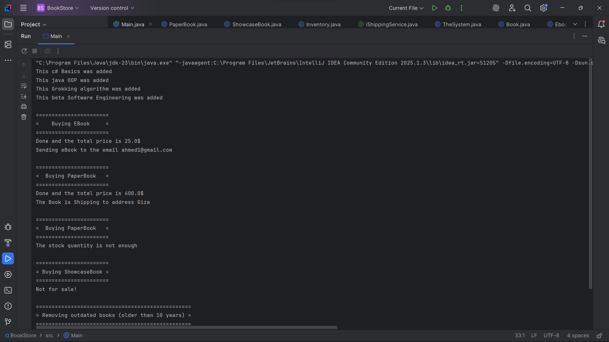
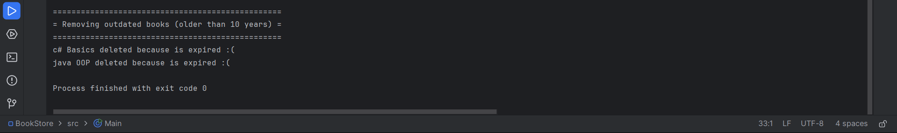

# 📚 Quantum Bookstore

**Quantum Bookstore** is a simple Java project that simulates an online bookstore. It’s designed using clean Object-Oriented Programming (OOP) principles, making the system highly extensible and maintainable.

---

## ✅ Features

- Supports multiple book types:
  - 📕 **PaperBook**: Physical books with stock, shipped to an address.
  - 📘 **EBook**: Digital books with file type, sent via email.
  - 📗 **ShowcaseBook**: Display-only books that cannot be purchased.
  
- Core functionalities:
  - Add a new book to the inventory.
  - Remove outdated books (older than a given number of years).
  - Buy books by ISBN, providing quantity, email, and shipping address.

- Clean OOP Design Principles:
  - **Single Responsibility Principle**
  - **Open/Closed Principle**
  - **Polymorphism and Encapsulation**

---

## 🛠️ How to Run

1. Open the project in your preferred IDE (e.g., IntelliJ IDEA, Eclipse, or VS Code).
2. Run the `Main` class.
3. Watch the output in the console showing:
   - Book purchases
   - Shipping/email simulation
   - Outdated book removal

---

## 🧱 Project Structure

📂 quantum-bookstore
├── Book.java
├── PaperBook.java
├── EBook.java
├── ShowcaseBook.java
├── Inventory.java
├── TheSystem.java
└── Main.java

---

## 🖼️ Screenshots

> 📸 *You can insert screenshots of your program in action here.*

Example:

  
*The Main to run the system*

  
*The output ofter runing the system*

  
*The output ofter runing the system*

---

## 🧩 How to Extend

To add a new type of book (e.g., `bla bla`):

1. Create a new class that extends `Book`.
2. Implement the `buy()` method according to the new logic.
3. Add the new book object to the store inventory.

✅ No changes are needed to existing classes.

---

## ✍️ Author

- Name: **[Ahmed Hossam]**
- GitHub: [[(https://github.com/ahmed-hossam-moka/)]]

---

